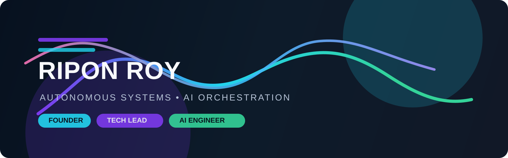

# Ripon Roy

### Founder-minded AI systems builder and technical leader

  
  
  

I build AI-native systems, product experiences, and operating models that turn vision into execution. Based in Toronto, I work at the intersection of technical leadership, product thinking, and autonomous workflow design.

My focus is building software that is not only intelligent, but operationally clear, scalable, and valuable in the real world.

## What I build

- AI orchestration systems and agentic workflow design
- Product strategy translated into technical architecture
- Human-centered software experiences with operational clarity
- Automation frameworks that reduce friction and increase velocity

## Leadership lens

- Turning ideas into roadmap, product direction, and engineering strategy
- Designing systems with ownership, clarity, and measurable impact
- Aligning AI, product, and business priorities around one operating model
- Building tools teams can trust, scale, and iterate with confidence

## AI engineering focus

- Multi-agent and multi-step orchestration patterns
- Prompt architecture and workflow logic for intelligent products
- Task routing, memory structures, and system feedback loops
- Monitoring, iteration, and human-in-the-loop optimization

## Featured work

### Agentic AI Company Hierarchy
A system design concept for structuring autonomous teams, specialized roles, and decision loops into a coherent operating model.

### Portfolio & Product Storytelling
A digital portfolio built to communicate technical depth, product thinking, and business clarity.

### Workflow Prototypes
Experimental systems for orchestration logic, AI task execution, and automation patterns.

## Stack

  
  
  
  
  
  

## GitHub stats

  
  

## Beyond the code

When I’m not building intelligent systems, I’m usually exploring automotive mechanics, ECU tuning, and the electric vehicle ecosystem.

## Let’s connect

Open to collaborations across AI product design, workflow automation, and system architecture.

- Portfolio: https://ripon.dev
- LinkedIn: https://linkedin.com
- Email: ripon@example.com
- GitHub: https://github.com

> Building intelligent systems with product clarity and founder-level execution.
